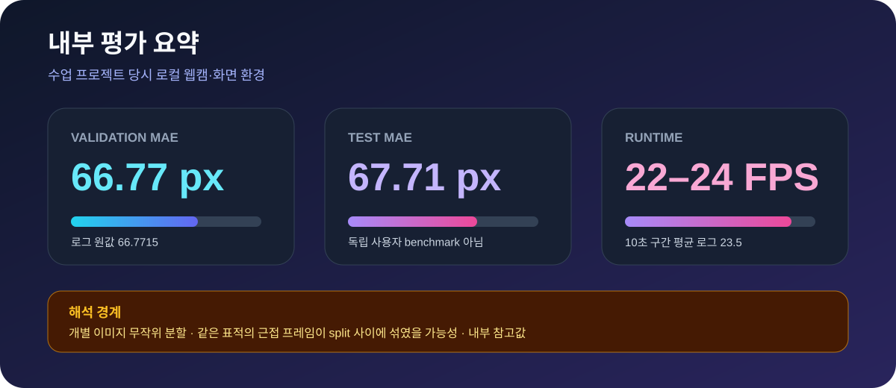

# 박상헌 (Sangheon Park)

### Embedded Systems · Robotics & UAVs · Computer Vision

센서 데이터가 실제 제어 명령으로 이어지는 전체 경로를 설계하고, **코드·측정값·한계**를 함께 남기는 엔지니어입니다. 전자제어공학과 컴퓨터과학을 바탕으로 임베디드 펌웨어, 로봇 비전, 무인기 시스템을 다룹니다.

## 전문 분야

- **임베디드 시스템:** STM32 펌웨어, 센서 인터페이스, 통신, 모터·액추에이터 제어
- **로보틱스·무인기:** PX4/MAVLink 연동, 비전 기반 상태 추정, 제어 명령 파이프라인
- **컴퓨터 비전:** OpenCV·PyTorch 기반 검출/회귀, RGB-D 카메라 처리, 실시간 추론
- **검증과 재현성:** 실행 경로, 측정 조건, 실패 사례와 미검증 범위를 함께 문서화

## 대표 프로젝트

> **공개 범위:** RealSense 코드는 공개 저장소로 제공하고, STM32·시선 추적 프로젝트는 공동/수업 코드의 재배포 권한을 다시 확인하기 전까지 전체 소스 저장소를 비공개로 유지합니다. 아래 설명과 비식별 이미지는 공개 포트폴리오에서 바로 확인할 수 있습니다.

<table>
  <tr>
    <td width="44%" valign="top">
      
    </td>
    <td width="56%" valign="top">
      <h3>1. STM32 자동 분리수거 시스템</h3>
      
<code>STM32</code> <code>C</code> <code>UART/Bluetooth</code> <code>Sensor &amp; Actuator</code>

      
두 MCU가 센싱·분류/구동·적재 상태 표시를 나누어 처리하는 자동 분리수거 프로토타입입니다.

      <ul>
        <li><strong>역할·범위:</strong> IR/초음파 센서 입력, 서보·스테퍼 구동, 보드 간 통신, LED·직렬 상태 출력을 하나의 동작 흐름으로 통합했습니다.</li>
        <li><strong>근거:</strong> 양쪽 보드의 최종 펌웨어, 프로젝트에 사용한 라이브러리, 전체 회로도와 데모 자료를 저장소에 정리했습니다.</li>
        <li><strong>현재 한계:</strong> 과거 프로젝트 보존본으로, 현재 도구 체인에서의 fresh build와 실물 bench 동작은 아직 다시 검증하지 않았습니다.</li>
      </ul>
      
🔒 <strong>전체 소스 저장소:</strong> 권리 확인 전 비공개 · <a href="https://www.youtube.com/watch?v=dkphMHEKzxE"><strong>팀 공개 데모 영상</strong></a>

    </td>
  </tr>
</table>

<table>
  <tr>
    <td width="44%" valign="top">
      
    </td>
    <td width="56%" valign="top">
      <h3>2. 시선 추적 마우스</h3>
      
<code>Python</code> <code>OpenCV</code> <code>PyTorch</code> <code>Real-time UI</code>

      
일반 웹캠 영상에서 시선 좌표를 추정하고, 시선 고정과 눈 깜빡임을 포인터 이동·클릭으로 연결한 공동 프로젝트입니다.

      <ul>
        <li><strong>팀 구현 범위:</strong> 얼굴/눈 ROI 처리, 사용자별 보정 데이터 수집, 화면 좌표 회귀, fixation·blink 입력 파이프라인을 하나로 연결했습니다.</li>
        <li><strong>내부 참고값:</strong> 개별 이미지 무작위 분할에서 validation MAE <strong>66.77 px</strong>, test MAE <strong>67.71 px</strong>, 실행 속도 <strong>22–24 FPS</strong>를 기록했습니다.</li>
        <li><strong>현재 한계:</strong> 같은 표적의 근접 프레임이 split 사이에 나뉘었을 수 있어 독립 test benchmark가 아니며, 다양한 사용자·조명 조건의 범용 성능을 뜻하지 않습니다.</li>
      </ul>
      
🔒 <strong>전체 소스 저장소:</strong> 공동저작 권리 확인 전 비공개 · <a href="https://www.youtube.com/watch?v=VR9T6X-zanU"><strong>팀 공개 데모 영상</strong></a>

    </td>
  </tr>
</table>

  
   
  개별 이미지 무작위 분할 내부 참고값: validation 66.77 px / test 67.71 px

<table>
  <tr>
    <td width="44%" valign="top">
      
    </td>
    <td width="56%" valign="top">
      <h3><a href="https://github.com/oldprize47-SH/realsense-drone-vision">3. RealSense 드론 비전</a></h3>
      
<code>Intel RealSense</code> <code>SSDLite/NCNN</code> <code>OpenCV</code> <code>Arduino Uno Q</code>

      
RGB-D 카메라로 착륙 표식을 검출하고, 픽셀·깊이 정보를 기체 기준 오프셋과 비행 제어 입력으로 연결한 비전 파이프라인입니다.

      <ul>
        <li><strong>역할·범위:</strong> 프레임 정렬, 소형 표식 검출, 깊이 기반 3차원 좌표화, body-FRD 변환과 Uno Q <code>Bridge.notify</code> 전달 경로를 저장소에서 확인할 수 있습니다.</li>
        <li><strong>근거:</strong> 65장·단일 클래스 로컬 validation에서 Precision <strong>100%</strong>, Recall <strong>93.8%</strong>, F1 <strong>96.8%</strong>, mAP@0.5:0.95 <strong>72.2%</strong>를 기록했습니다.</li>
        <li><strong>현재 한계:</strong> vision lock이 확인된 실외 비행 6회 중 <code>partial/near</code> 판정은 1회뿐이었으며, 완전한 자율 착륙 성공을 입증한 결과는 아닙니다.</li>
      </ul>
      
<a href="https://github.com/oldprize47-SH/realsense-drone-vision#readme"><strong>파이프라인과 검증 범위 자세히 보기 →</strong></a>

    </td>
  </tr>
</table>

## 기술 스택

`C` `C++` `Python` `MATLAB/Simulink` `STM32` `PX4/MAVLink` `OpenCV` `PyTorch` `Intel RealSense` `Git`

## 작업 방식

1. 요구사항과 성공 기준을 먼저 관찰 가능한 동작으로 고정합니다.
2. 센서 입력부터 최종 제어 출력까지 가장 짧은 end-to-end 경로를 구현합니다.
3. 코드뿐 아니라 테스트, 빌드, 측정 로그, 실물/비행 검증 여부를 함께 남깁니다.
4. 재현하지 못한 결과와 실패한 실험은 성공 사례와 분리해 명시합니다.

> **기록 원칙**
>
> 공동 프로젝트는 팀 전체 결과와 이 저장소에서 확인 가능한 구현 범위를 구분합니다. 정량 수치는 데이터 규모, 분할 방식, 실행 환경과 함께 해석하며 다른 환경으로 일반화해 과장하지 않습니다.

---

과거 커밋은 이전 사용자명 <code>oldprize47</code> 또는 <code>sangheon47</code>로 표시될 수 있습니다. 기록 보존형 저장소는 기존 작성자 이력을 유지하고, 공동 작업은 각 프로젝트 문서에서 별도로 밝힙니다.
