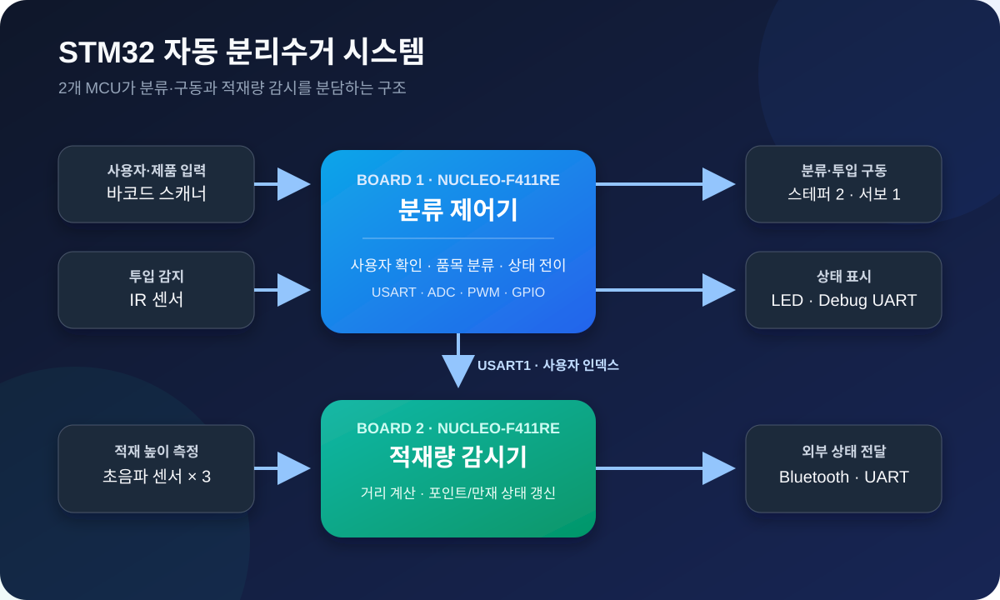
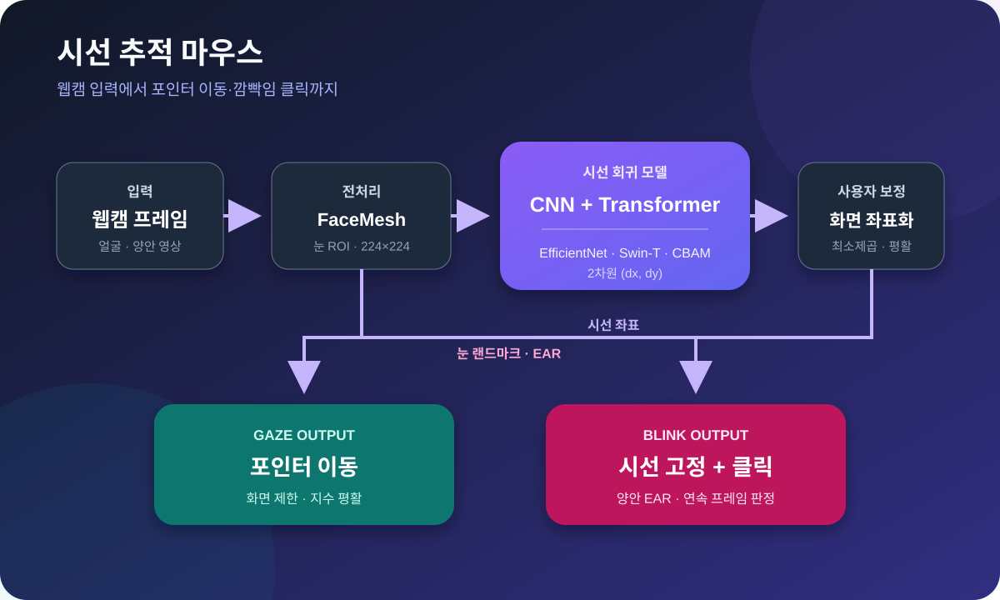

# Sangheon Park

### Embedded systems · Control · Robotics · Computer vision

[한국어 소개](README.ko.md)

I studied electronic control engineering and computer science. My university
projects connect sensor inputs, embedded software and physical systems, with an
emphasis on documenting what was built, how it was checked and where it falls short.
I am interested in internship and graduate engineering opportunities in embedded
software, control and robotics.

## Selected projects

### 1. Autonomous Drone Development — camera and vision contribution

**Python · OpenCV · Intel RealSense D435 · SSDLite/NCNN · Arduino Uno Q**

I was responsible for the camera and vision work within the course team: image
collection and labelling, model comparison and selection, embedded inference,
detection/tracking comparisons, and checking the position and validity information
provided to the flight-control team. Flight-controller and ground-station work
remain credited as team contributions.

[**Team project fork: architecture, flight demo and results**](https://github.com/oldprize47-SH/Autonomous_Drone_Development)
 · [**My vision implementation**](https://github.com/oldprize47-SH/realsense-drone-vision/blob/main/README.en.md)

The vision report records precision 100% and recall 93.8% on a local, single-class
65-image validation set. These figures are not an independent generalisation
benchmark. The team approached the landing target but did not demonstrate repeatable,
accurate marker-centre landing.

### 2. STM32 automatic recycling system

**C · STM32 · Sensors · Motor control · Serial communication**

A team coursework prototype combining sensing, classification/actuation and bin
status reporting across two microcontrollers. I contributed to the physical
prototype, wiring within my assigned scope, and integration with my teammate.
The complete system and course-library code are not solely my work.

[**Team demonstration**](https://www.youtube.com/watch?v=dkphMHEKzxE)

The source archive remains private pending redistribution checks. Its build and
physical operation have not been freshly verified for this profile update.

### 3. Gaze Tracking Mouse

**Python · PyTorch · OpenCV · Webcam-based interaction**

A joint course project exploring webcam-based gaze estimation and mouse interaction.
The project combines a gaze model, calibration and pointer/click handling.

[**Team demonstration**](https://www.youtube.com/watch?v=VR9T6X-zanU)

Historical internal figures are validation MAE 66.77 px, test MAE 67.71 px and
22–24 FPS. Nearby frames of the same target may have crossed the image-level split,
so these are internal reference results, not independent test performance.
The full source remains private pending joint-authorship checks.

## Technical background

C/C++, Python, MATLAB/Simulink, STM32 peripherals, sensor and motor interfaces,
OpenCV and PyTorch, RGB-D processing, and Git.

## How I present my work

I separate individual responsibility from team results and AI-assisted implementation.
I keep measured results attached to their dataset and test conditions, and distinguish
host tests, compilation, recorded-data replay and physical-system validation.
The public team fork preserves the original authors and history.

Older project history may use `oldprize47` or `sangheon47`. This account is my
portfolio entry point.
